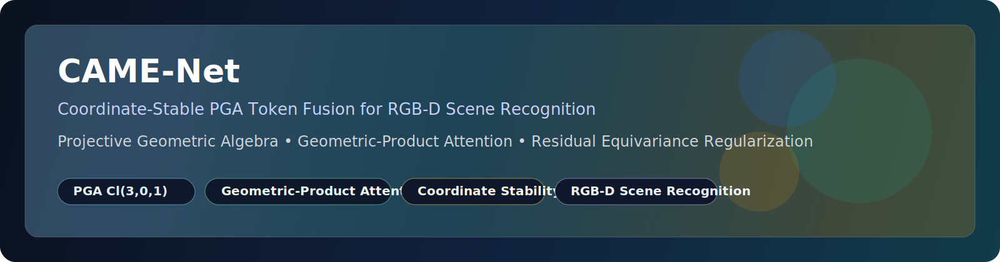
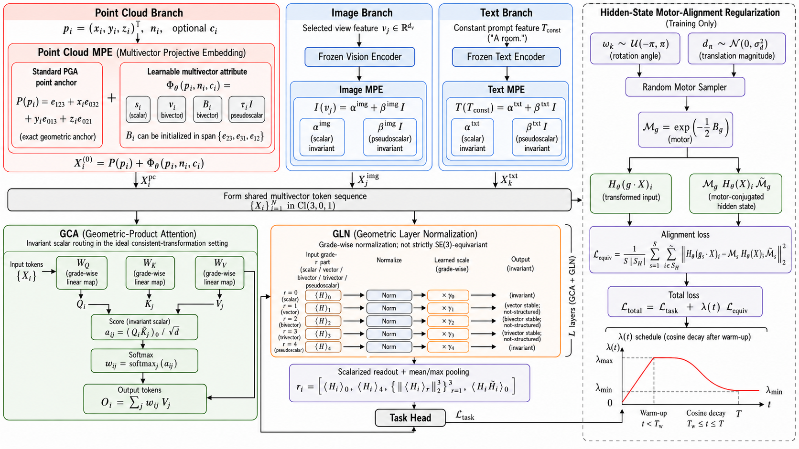
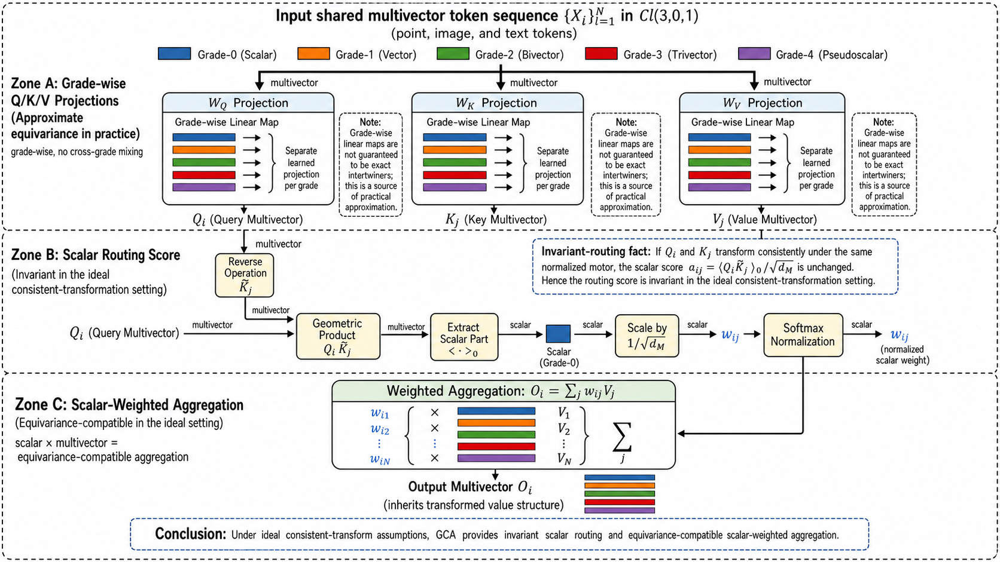
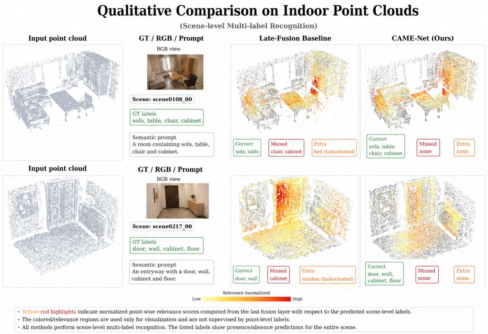
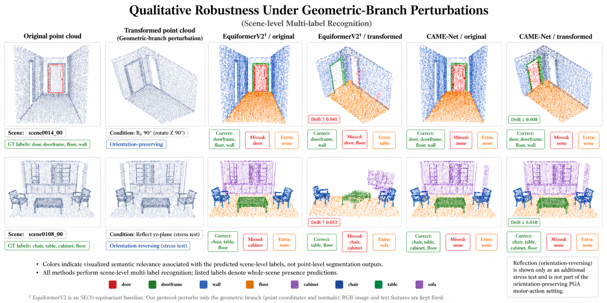
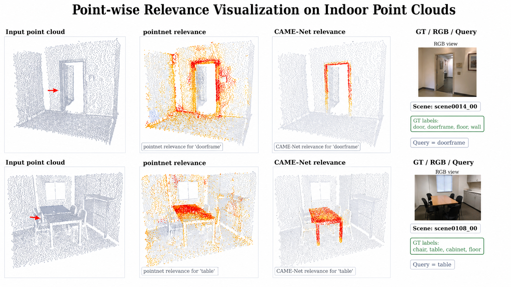
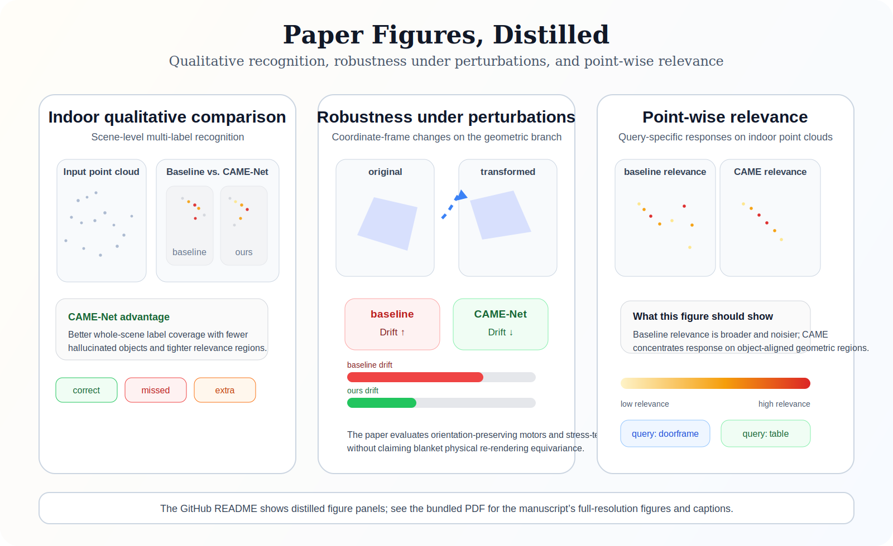

<p align="center">
  
</p>

<p align="center">
  <a href="assets/readme/CAME-Net-paper.pdf"></a>
  <a href="docs/CODE_MAP.md"></a>
  <a href="docs/EXPERIMENTS.md"></a>
  
  
</p>

<p align="center">
  <b>CAME-Net</b> is a research codebase for
  <b>coordinate-stable RGB-D scene recognition</b> using
  <b>projective geometric algebra (PGA, <code>Cl(3,0,1)</code>)</b>,
  point-anchored multivector tokens, and geometric-product attention.
</p>

<p align="center">
  <i>A geometry-first multimodal project focused on stable scene understanding under coordinate-frame perturbations.</i>
</p>

<p align="center">
  <a href="#paper-figures-at-a-glance">Figure Gallery</a> |
  <a href="#key-highlights">Key Highlights</a> |
  <a href="#repository-layout">Repository Layout</a> |
  <a href="#quick-start">Quick Start</a> |
  <a href="#visualization-scripts">Visualization Scripts</a>
</p>

---

## Overview

RGB-D scene recognition must integrate visual appearance and 3D geometry while remaining stable when the coordinate frame of the geometric branch changes. CAME-Net addresses this by representing point clouds, frozen image features, and constant text context in a shared projective geometric algebra token space, while assigning them different geometric roles.

The method is built around four ideas:

- **Point-Anchored Multivector Embedding (MPE)** for encoding 3D points as standard PGA anchors plus learnable multivector attributes.
- **Geometric Clifford Attention (GCA)** using the scalar part of the geometric product as an invariant routing score.
- **Geometric Layer Normalization (GLN)** for stable multivector processing with grade-aware structure.
- **Residual equivariance regularization** to reduce hidden-state sensitivity under sampled rigid transformations.

This repository is organized so the **method implementation is easy to inspect first**, while experiments and figure-generation scripts remain separate.

## Paper

- **Title:** *CAME-Net: Coordinate-Stable PGA Token Fusion for RGB-D Scene Recognition*
- **Bundled PDF:** [assets/readme/CAME-Net-paper.pdf](assets/readme/CAME-Net-paper.pdf)

### Abstract

> RGB-D scene recognition requires integrating visual appearance with 3D geometry while remaining stable when the coordinate frame of the geometric input changes. We propose CAME-Net, a coordinate-stable multimodal framework that represents point clouds, frozen image features, and constant text context as tokens in a shared projective geometric algebra multivector space. CAME-Net anchors each 3D point with the standard PGA point representation, encodes image and text features as invariant scalar and pseudoscalar tokens, and fuses modalities through geometric-product attention. Since practical learned modules are not exact intertwiners, we further introduce a hidden-state motor-alignment regularizer to reduce residual coordinate-frame sensitivity before readout.

## Teaser

<table>
  <tr>
    <td width="33%" valign="top">
      <h3>Geometry-first representation</h3>
      <p><b>Point-cloud tokens are anchored by standard PGA point carriers</b> instead of treated as plain Euclidean feature vectors.</p>
      <p><sub>Local geometry, appearance, and semantic attributes are attached to explicit multivector anchors in <code>Cl(3,0,1)</code>.</sub></p>
    </td>
    <td width="33%" valign="top">
      <h3>Invariant routing core</h3>
      <p><b>The scalar part of the geometric product acts as the strict invariant score</b> inside multimodal attention.</p>
      <p><sub>This lets the routing kernel stay principled even when the surrounding practical layers are only approximately equivariant.</sub></p>
    </td>
    <td width="33%" valign="top">
      <h3>Coordinate-stable behavior</h3>
      <p><b>The full network is approximately equivariant in practice</b> and empirically reduces prediction drift under geometric-branch perturbations.</p>
      <p><sub>The project emphasizes stable behavior and transparent geometric diagnostics rather than overstated exact symmetry claims.</sub></p>
    </td>
  </tr>
</table>

## Paper Figures at a Glance

<h3 align="center">Method & Recognition</h3>

<table>
  <tr>
    <td width="33%">
      <a href="assets/readme/architecture.png">
        
      </a>
    </td>
    <td width="33%">
      <a href="assets/readme/gca.png">
        
      </a>
    </td>
    <td width="33%">
      <a href="assets/readme/qualitative-scenes.png">
        
      </a>
    </td>
  </tr>
  <tr>
    <td valign="top">
      <b>Architecture.</b> Point-cloud PGA tokens, frozen image/text branches, GCA fusion, GLN, and hidden-state motor-alignment regularization.
    </td>
    <td valign="top">
      <b>Invariant routing.</b> The scalar part of the geometric product is used as the strict invariant routing score inside attention.
    </td>
    <td valign="top">
      <b>Scene recognition.</b> CAME-Net yields cleaner scene-level label sets and tighter relevance regions than a late-fusion baseline.
    </td>
  </tr>
</table>

<h3 align="center">Robustness & Relevance</h3>

<table>
  <tr>
    <td width="33%">
      <a href="assets/readme/robustness-comparison.png">
        
      </a>
    </td>
    <td width="33%">
      <a href="assets/readme/point-relevance.png">
        
      </a>
    </td>
    <td width="33%">
      <a href="assets/readme/CAME-Net-paper.pdf">
        
      </a>
    </td>
  </tr>
  <tr>
    <td valign="top">
      <b>Coordinate stability.</b> Under geometric-branch perturbations, CAME-Net maintains lower prediction drift and more stable scene semantics.
    </td>
    <td valign="top">
      <b>Point relevance.</b> Query-conditioned relevance maps are more concentrated on object-aligned geometric regions, with fewer spurious activations.
    </td>
    <td valign="top">
      <b>Full manuscript.</b> The bundled paper contains the original high-resolution figures, quantitative tables, and formal method details.
    </td>
  </tr>
</table>

The homepage shows the manuscript's visual story directly:

- **Method:** point-anchored PGA tokenization, geometric-product attention, grade-aware normalization, and residual motor-alignment regularization.
- **Recognition quality:** scene-level multi-label predictions and object-aligned relevance are stronger than generic late fusion.
- **Robustness:** the geometric branch remains more stable under coordinate-frame perturbations, matching the paper's coordinate-stability claim.
- **Full-resolution figures and captions:** see [`assets/readme/CAME-Net-paper.pdf`](assets/readme/CAME-Net-paper.pdf).

## Key Highlights

<table>
  <tr>
    <td width="25%" valign="top">
      <h4>PGA Cl(3,0,1)</h4>
      <p>The geometric backbone is built in projective geometric algebra rather than plain Euclidean token fusion.</p>
    </td>
    <td width="25%" valign="top">
      <h4>Invariant scalar routing</h4>
      <p>The strict invariant core appears inside attention through the scalar geometric-product score.</p>
    </td>
    <td width="25%" valign="top">
      <h4>Approximate equivariance</h4>
      <p>The project explicitly distinguishes ideal equivariance arguments from practical, trainable geometry-compatible modules.</p>
    </td>
    <td width="25%" valign="top">
      <h4>Figure tooling included</h4>
      <p>The repository packages scripts for qualitative scenes, robustness panels, and point-wise relevance visualizations.</p>
    </td>
  </tr>
</table>

## Why CAME-Net

The repository should be read as a **geometry-first multimodal research project**, not a generic deep learning code dump.

What makes CAME-Net distinctive:

- It uses **PGA `Cl(3,0,1)`** rather than plain Euclidean feature fusion.
- It treats the **scalar geometric-product score** as the strict invariant core inside attention.
- It targets **coordinate stability** rather than claiming blanket strict end-to-end `SE(3)` equivariance.
- It is designed for **RGB-D scene recognition**, where point tokens, frozen image features, and text context do **not** share the same transformation law.

## What the Repository Demonstrates

The codebase is organized around three complementary claims from the paper:

1. **Geometric representation matters.**
   The point-cloud branch is not treated as an unordered Euclidean token list; it is anchored in PGA `Cl(3,0,1)` with explicit multivector structure.
2. **The invariant core is local and precise.**
   The scalar part of the geometric product provides the strict routing invariant inside attention, while the surrounding trainable modules remain geometry-compatible rather than overstated as exact intertwiners.
3. **Robustness should be visible, not only tabulated.**
   The repository includes qualitative scene figures, transformation-robustness panels, and point-wise relevance visualizations so the geometric branch behavior can be inspected directly.

## Deeper Read Paths

<table>
  <tr>
    <td width="33%" valign="top">
      <h4>Read the method</h4>
      <p>Start from the algebra, tokenization, attention, normalization, and regularization stack.</p>
      <p><a href="docs/CODE_MAP.md">Open the code map</a></p>
    </td>
    <td width="33%" valign="top">
      <h4>Run the experiments</h4>
      <p>Use the packaged ScanNet and ModelNet40 entrypoints for training, robustness benchmarks, and figure generation.</p>
      <p><a href="docs/EXPERIMENTS.md">Open the experiment guide</a></p>
    </td>
    <td width="33%" valign="top">
      <h4>Inspect the paper figures</h4>
      <p>The bundled manuscript provides the original figure captions, table context, and formal exposition.</p>
      <p><a href="assets/readme/CAME-Net-paper.pdf">Open the PDF</a></p>
    </td>
  </tr>
</table>

## Repository Layout

```text
CAME-Net/
├── method/        # core PGA / Clifford method implementation
├── training/      # training loop, data utilities, runtime compatibility
├── experiments/   # benchmarks, ablations, ScanNet workflows, figure scripts
├── scripts/       # dataset preparation / download helpers
├── docs/          # code map and experiment-oriented notes
└── assets/readme/ # paper assets for the GitHub homepage
```

### If you only want to understand the method

Read these files in order:

1. [`method/pga_algebra.py`](method/pga_algebra.py)
2. [`method/mpe.py`](method/mpe.py)
3. [`method/gca.py`](method/gca.py)
4. [`method/gln.py`](method/gln.py)
5. [`method/equiv_loss.py`](method/equiv_loss.py)
6. [`method/came_net.py`](method/came_net.py)
7. [`training/train.py`](training/train.py)

Then use:

- [`docs/CODE_MAP.md`](docs/CODE_MAP.md) for a method-to-code walkthrough
- [`docs/EXPERIMENTS.md`](docs/EXPERIMENTS.md) for runnable entrypoints

## What Is Included

### Core method stack

- PGA basis and multivector algebra
- Point-anchored multivector tokenization
- Geometric-product attention
- Geometric layer normalization
- Hidden-state equivariance regularization

### Experiments currently packaged

- **ModelNet40** single-label point-cloud classification
- **ScanNet** scene-level multimodal multi-label recognition
- **ScanNet rigid benchmark** under coordinate-frame perturbations
- **Paper-oriented visualization scripts** for:
  - qualitative scene comparisons,
  - robustness under spatial transformations,
  - point-wise relevance heatmaps

### Scope note

The paper protocol also discusses **MatterPort3D**, but a standalone public MatterPort3D adapter is **not yet packaged as a first-class workflow** in this repository. The strongest public paths right now are:

- method inspection,
- ModelNet40 experiments,
- ScanNet multimodal training,
- ScanNet robustness and figure generation.

## Installation

### Option A

```bash
pip install -r requirements.txt
```

### Option B

```bash
pip install -e .
```

## Quick Start

### Train the core point-cloud model

```bash
python -m training.train --data_root ./ModelNet40 --epochs 300 --batch_size 32 --device cuda
```

### Run a small ModelNet40 experiment

```bash
python -m experiments.run_small_modelnet_experiment
```

### Run ScanNet multimodal training

```bash
python -m experiments.run_scannet_multimodal_experiment --data-root ./ScanNet-small --device cuda
```

### Run the ScanNet rigid benchmark

```bash
python -m experiments.run_scannet_rigid_benchmark --method came --data-root ./ScanNet-small --device cuda
```

## Visualization Scripts

The repository includes scripts for paper-style qualitative figures:

- `python -m experiments.run_scannet_qualitative_figure`
- `python -m experiments.run_scannet_spatial_robustness_figure`
- `python -m experiments.run_scannet_point_relevance_figure`
- `python -m experiments.run_scannet_paper_visualizations`

These scripts are intended for **research artifacts and manuscript figures**, not just debugging.

## Datasets

### ModelNet40

Supported through:

- [`training/data_utils.py`](training/data_utils.py)
- [`scripts/prepare_modelnet40.py`](scripts/prepare_modelnet40.py)
- [`experiments/small_modelnet_experiment.py`](experiments/small_modelnet_experiment.py)

### ScanNet

Supported through:

- ScanNet experiment and visualization entrypoints under [`experiments/`](experiments/)
- Public repository support is focused on training, robustness evaluation, and figure generation once the dataset is prepared locally.

## Project Positioning

CAME-Net should be interpreted as an **approximately equivariant multimodal PGA network**:

- the **scalar geometric-product score** is the strict invariant core,
- the full network is **geometry-compatible** rather than analytically exact,
- residual equivariance regularization is used to **reduce hidden-state equivariance error empirically**.

In other words, the project is about **stable multimodal geometry-aware recognition**, not about overstating exact symmetry guarantees.

## Current Limitations

- This is a **research repository**, not a polished production framework.
- ScanNet workflows are designed for iteration and analysis, not large-scale distributed training.
- MatterPort3D is discussed in the paper protocol but not yet packaged as a public first-class adapter.
- Some qualitative scripts depend heavily on checkpoint quality; smoke outputs validate layout, not publication-grade semantics.

## Citation

If you use this repository in academic work, please cite the CAME-Net paper.

```bibtex
@misc{came_net_2026,
  title        = {CAME-Net: Coordinate-Stable PGA Token Fusion for RGB-D Scene Recognition},
  author       = {Anonymous Authors},
  year         = {2026},
  note         = {Research code and manuscript release}
}
```

## Acknowledgment

This repository is structured to make the **core method implementation legible first**: the algebra, tokenization, attention, normalization, and regularization code paths are separated from benchmark and paper-figure scripts so the main idea can be inspected without reading the entire experiment stack.
